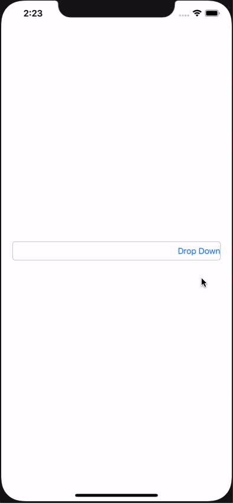

# ASDropDown

[](https://travis-ci.org/amitpstu1@gmail.com/ASDropDown)
[](https://cocoapods.org/pods/ASDropDown)
[](https://cocoapods.org/pods/ASDropDown)
[](https://cocoapods.org/pods/ASDropDown)

Screenshots
---------


    
## Example
    ```swift
    
    import ASDropDown

    let items = (0..<100).map({return ASDropDownItem(key: "key_\($0)", title: "item-\($0)")})
    
    ASDropDown.openDropDown(items, nil, { (index: Int, item: String) in
        self.textField.text = item
     }, anchorpointView, nil)
        
    ```

## DropDown Customization Properties

```swift

import ASDropDown

let items = (0..<100).map({return ASDropDownItem(key: "key_\($0)", title: "item-\($0)")})
ASDropDown.openDropDown(items, ASDropDownProp(UIFont.systemFont(ofSize: 15), UIColor.red), { [unowned self] (index: Int, item: String) in
    self.textField.text = item
    }, anchorpointView, nil)
    
```

## Requirements

## Installation

ASDropDown is available through [CocoaPods](https://cocoapods.org). To install
it, simply add the following line to your Podfile:

```ruby
pod 'ASDropDown'
```

## Author

amitpstu1@gmail.com, amitpstu1@gmail.com

## License

ASDropDown is available under the MIT license. See the LICENSE file for more info.
